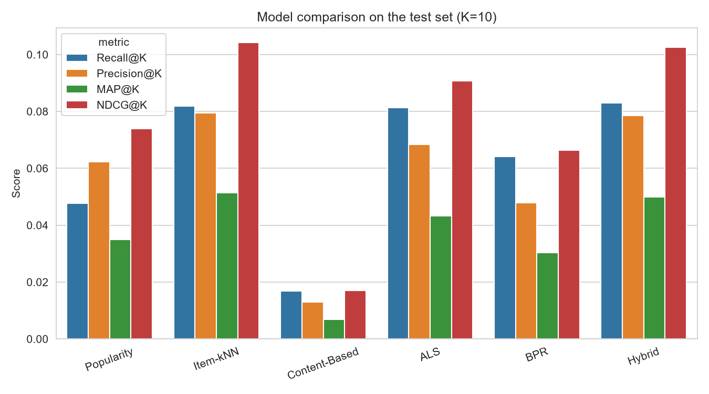
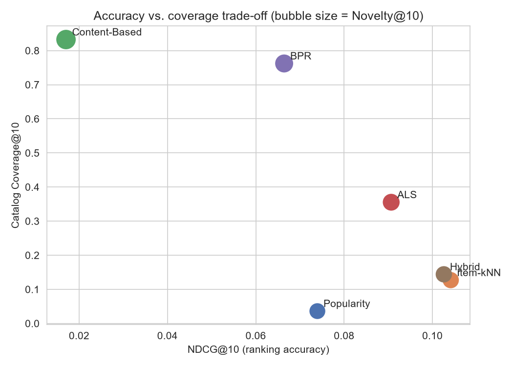
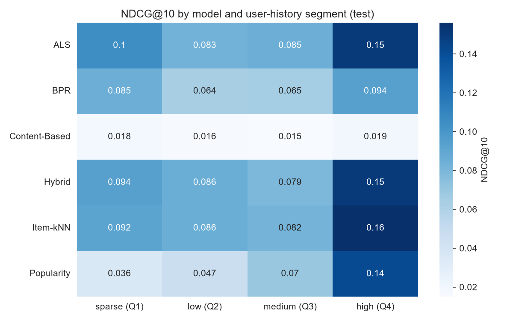

# Movie Recommendation System — MovieLens 1M

A recommendation-system case study built as a portfolio piece for
product/ML analyst roles: it compares popularity, content-based, item-based
collaborative, matrix-factorization and hybrid recommenders on MovieLens-1M
under one honest, leakage-free evaluation protocol, then turns the offline
result into a product decision and an online test design.

This is a rebuild of an earlier version of this project, and this README
itself has already been through one round of external methodological
review after the rebuild — several numbers and conclusions below changed as
a direct result of that review (see "What changed in the review pass"
below the executive summary). Correctness was prioritized over a clean
narrative both times.

## Executive Summary

- **A matrix-orientation bug had made ALS look broken.** The previous
  version fit `implicit`'s ALS on a `(items, users)` matrix instead of
  `(users, items)`; the call did not error, it silently scored every user
  against the wrong factors, producing NDCG@10 ≈ 0. Fixing the orientation,
  and later choosing the right interaction representation for it (below),
  makes ALS the **best single model on test** (NDCG@10 = **0.106**).
- **Item-kNN, ALS and BPR each learn best from a different representation
  of the same ratings, and that was tested rather than assumed.** Item-kNN
  does best treating every interaction as a weighted positive signal;
  ALS and BPR do measurably better restricted to `rating >= 4`
  interactions only (ALS: 0.088→0.100 validation NDCG@10; BPR: 0.065→0.078).
  Both choices came from a validation-only ablation, not a guess.
- **A segment-based routing strategy looked like the best result in this
  project before its uncertainty was actually quantified.** A paired
  bootstrap shows its edge over Item-kNN, and its shortfall against ALS,
  both have 95% confidence intervals that include zero — offline evidence
  does not support shipping it. The Hybrid model is the one place the
  bootstrap *does* find a significant effect: it is measurably, if only
  slightly, **worse** than the plain Item-kNN it is built on.
- **Relevant test/validation interactions on items outside the candidate
  catalog are now excluded from ranking metrics, not silently counted as
  misses** — item cold start (0.01–0.02% of relevant interactions here) is
  reported as its own number instead of being folded into every model's score.
- **Popularity beats Content-Based but loses to every collaborative/hybrid
  model** (NDCG@10 = 0.074) — a real, checkable baseline now that it is
  actually in the comparison, not the claim "every personalized model beats
  it" (Content-Based, itself personalized, does not).
- **LightFM could not be installed** on this environment (its legacy build
  script fails under modern `setuptools` on Windows/Python 3.12); `implicit`'s
  BPR was substituted as the ranking-loss model.

## What changed in the review pass

An independent review of the first rebuild flagged five methodological
gaps, all addressed here:

1. **Candidate catalog vs. evaluation truth.** Ranking metrics previously
   counted a relevant item as a miss even when no model could have
   recommended it (item not yet in the candidate catalog). Truth is now
   intersected with the candidate catalog before computing Recall/Precision/
   MAP/NDCG, and the excluded share is reported separately as the
   item-cold-start rate (`src/data.py::restrict_truth_to_catalog`).
2. **Explicit-rating semantics.** Item-kNN/ALS/BPR previously all treated
   every observed rating as a positive signal by default. A validation-only
   ablation (`02_evaluation_setup.ipynb` Section 4.7) now compares that
   against a positive-only (`rating >= 4`) representation per model and
   picks the winner on validation NDCG@10 only — the two families
   disagreed, and both outcomes are kept.
3. **Test-set discipline wording.** "The test set is touched exactly once"
   was replaced with the actual principle: *all hyperparameters,
   interaction representations, and the routing policy are selected on
   validation only; the held-out test set is used for the final
   comparative benchmark across the pre-specified model families and to
   form the product recommendation, with no further offline tuning after
   observing test results.* The `rating >= 3` sensitivity check was moved
   from test to validation, and the routing policy is now explicitly
   frozen from validation before any test-set segment result is computed.
4. **Router uncertainty.** A paired user-level bootstrap
   (`src/evaluation.py::paired_bootstrap_ci`) now reports a delta and 95%
   CI for Router vs. Item-kNN, Hybrid vs. Item-kNN, and Router vs. ALS,
   instead of asserting the router is better from a point estimate alone.
5. **README overclaims.** Language claiming the router "beats every model
   on every metric" or that popularity "loses to every personalized model"
   is corrected below to match what the numbers actually show.

Dependency versions are now pinned in `requirements.txt` to the versions
this run was produced with.

## Recommendation Problem

Generate a ranked list of movies a user has not yet seen, using their rating
history and each movie's genre/year metadata, such that the movies they go
on to rate highly actually appear near the top of that list. Models are
compared as **rankers**, using Recall/Precision/MAP/NDCG@10, not as rating
predictors (RMSE was intentionally not used — see `02_evaluation_setup.ipynb`
for why ranking metrics fit this task better).

## Dataset

MovieLens-1M: 1,000,209 ratings from 6,040 users on 3,706 rated movies
(3,883 in the full catalog; 177 have never been rated), ratings 1–5,
timestamps, and movie genres. The user-movie matrix is **95.5%** sparse
(`1 - 1,000,209 / (6,040 × 3,706)`) — the original version of this README
stated "~99.9%", which did not match what its own notebook computed; that
was corrected in the first rebuild.

Full analysis: `notebooks/01_data_and_eda.ipynb`.

## Evaluation Setup

**Split.** Chronological, per user: each user's interactions are sorted by
timestamp and cut into contiguous **train (~70%) / validation (~15%) / test
(~15%)** blocks. MovieLens-1M guarantees at least 20 ratings per user, so
every user contributes to all three blocks (minimum 14 train interactions).
A random split was rejected because rating activity is strongly non-uniform
over time (`01_data_and_eda.ipynb`) — it would let a model see the future of
some of its own training users.

**Relevance.** `rating >= 4` counts as a relevant recommendation (57.5% of
all ratings). `rating >= 3` would mark 83.6% of interactions "relevant" —
too lenient to be a useful target. Applied identically to every model, in
every split; a validation-only robustness check confirms it does not change
which model wins (`02_evaluation_setup.ipynb`, Section 6).

**Candidates, exclusion, and recommendable truth.** Every model ranks the
same catalog — items seen at least once in the data available at that
point (train only while tuning; train+validation for the final test run) —
and has each user's own already-interacted items (any rating) removed
before ranking. A relevant item that is **not** in that candidate catalog
cannot be recommended by *any* model, so it is excluded from
Recall/Precision/MAP/NDCG rather than counted as a miss for every model
alike (`src/data.py::restrict_truth_to_catalog`). This exclusion is small
here — **0.01% of validation and 0.02% of test relevant interactions** — but
it is measured and reported rather than assumed away; see Cold Start.

**Model/representation/policy selection discipline.** All hyperparameters,
interaction representations, and the routing policy are selected on
validation only, in `notebooks/02_evaluation_setup.ipynb` (models,
hyperparameters, the content-based history threshold, the hybrid weight,
and the all-interactions-vs-positive-only representation for
Item-kNN/ALS/BPR) and `notebooks/04_product_analysis.ipynb` (the segment
routing policy, frozen before any test-set segment result is computed). The
held-out test set is used for the final comparative benchmark across these
pre-specified model families and to form the product recommendation; no
further offline tuning is performed after observing test results.

## Models Compared

| Model | What it does |
|---|---|
| **Popularity** | Ranks by raw train interaction count. Non-personalized. |
| **Item-kNN** | Cosine similarity between movies' train rating vectors; scores = rating-weighted similarity to a user's own history. Uses **all interactions** (validation-selected, `02` Section 4.7). |
| **Content-Based** | Cosine similarity over genre + normalized release-year vectors; user profile = train movies rated ≥4 (threshold chosen on validation). |
| **ALS** | `implicit` Alternating Least Squares, correctly oriented `(users, items)` (see the orientation-bug writeup in `02`), confidence-weighted (`1 + 2·(rating-1)`). Uses **positive-only (`rating >= 4`) interactions** (validation-selected). |
| **BPR** | `implicit` Bayesian Personalized Ranking — pairwise ranking loss; stands in for LightFM (see Limitations). Also uses **positive-only interactions** (validation-selected). |
| **Hybrid** | Content-Based + Item-kNN scores, each min-max normalized per user, blended `0.1·content + 0.9·Item-kNN` (weight and partner model chosen on validation, `02`). |

## Final Test Results (K = 10)

| Model | Recall@10 | Precision@10 | MAP@10 | NDCG@10 | Coverage@10 | Novelty@10 | Diversity@10 | Avg. Popularity@10 |
|---|---:|---:|---:|---:|---:|---:|---:|---:|
| Popularity | 0.048 | 0.062 | 0.035 | 0.074 | 0.036 | 8.50 | 0.645 | 2379 |
| Item-kNN | 0.082 | 0.080 | 0.051 | 0.104 | 0.126 | 8.94 | 0.635 | 1847 |
| Content-Based | 0.017 | 0.013 | 0.007 | 0.017 | **0.832** | **13.14** | 0.085 | **259** |
| **ALS** | **0.090** | **0.081** | **0.052** | **0.106** | 0.298 | 9.59 | 0.618 | 1288 |
| BPR | 0.070 | 0.056 | 0.035 | 0.077 | 0.643 | 11.10 | 0.480 | 605 |
| Hybrid (Content + Item-kNN) | 0.083 | 0.078 | 0.050 | 0.103 | 0.144 | 9.04 | 0.581 | 1734 |
| Routing strategy (below) | 0.084 | 0.080 | 0.051 | 0.105 | 0.138 | 8.99 | 0.608 | 1791 |

*(Metrics computed against the recommendable truth — see Evaluation Setup.
Full numbers in `reports/tables/test_metrics.csv`.)*



**Reading it:** ALS leads on every ranking metric here — after fixing its
orientation bug and giving it the representation it actually prefers
(positive-only interactions, see below), it is not just "competitive", it
is the most accurate model measured. It also provides substantially
broader catalog coverage than the other high-accuracy models, Item-kNN
(0.13) and Hybrid (0.14): its own coverage is 0.30. BPR (0.64) and
Content-Based (0.83) reach more of the catalog still, but at a substantial
ranking-quality cost. Item-kNN and Hybrid are
close in aggregate point estimates (NDCG@10 0.104 vs. 0.103), but the
paired bootstrap (see "How Much Confidence Do We Have in the Routing
Gain?") shows the Hybrid is consistently, if slightly, worse than Item-kNN.
Popularity beats Content-Based but loses to every collaborative/hybrid
model. BPR (the LightFM substitute) improved substantially from the same
representation switch as ALS but remains behind the other collaborative
models on accuracy. Content-Based is the weakest model on ranking accuracy
by a wide margin — genre similarity alone is a poor predictor of which
specific movie a user will rate highly next.

## Interaction Representation Ablation

Item-kNN, ALS and BPR all *can* be fed either every observed interaction
("all interactions", including `rating=1`) or only relevant ones
(`rating >= 4`, "positive-only") as their training signal. Which one is
better is not obvious in advance — dropping low ratings removes noise but
also throws away real negative-preference information and shrinks the
training data — so it was tested on **validation only**
(`02_evaluation_setup.ipynb`, Section 4.7), per model, using each model's
already-chosen hyperparameters:

| Model | All interactions (A) | Positive-only (B) | Chosen |
|---|---:|---:|---|
| Item-kNN | **0.1114** | 0.1083 | A (all interactions) |
| ALS | 0.0881 | **0.0998** | B (positive-only) |
| BPR | 0.0651 | **0.0778** | B (positive-only) |

*(Validation NDCG@10.)* Item-kNN already weights its similarity
contributions by rating value, so a `rating=1` interaction only contributes
a small positive weight and the extra co-occurrence data from keeping it
outweighs the residual noise. ALS and BPR are proper implicit-feedback
factorization models — feeding them a `rating=1` row as "the user consumed
this, confidence≈1" is a real semantic mismatch with what a low rating
actually means, and removing those rows measurably helps both.

## Relevance vs. Coverage/Diversity Trade-offs



Two trade-offs came out of the numbers (not assumed beforehand):

1. **Accuracy vs. catalog coverage.** ALS leads on ranking accuracy while
   providing substantially broader catalog coverage than the other
   high-accuracy models, Item-kNN and Hybrid (13–14% coverage vs. ALS's
   30%) — it is not "accurate but narrow" the way those two are. BPR and
   Content-Based reach more of the catalog still (64% and 83%), but at a
   substantial ranking-quality cost: Content-Based in particular is the
   extreme opposite of ALS, combining the weakest accuracy with the widest
   coverage (83%) of any model.
2. **Catalog coverage and within-list diversity are not the same thing.**
   Content-Based has the highest coverage **and** the lowest intra-list
   diversity (0.085): it reaches many different corners of the catalog
   *across users*, but for any one user it returns a genre-homogeneous
   cluster. Popularity is the mirror image: near-zero coverage (the same
   handful of movies for everyone) but comparatively high intra-list
   diversity (0.645), because the most popular movies overall span many
   genres. A model can score well on one "diversity-shaped" metric and
   poorly on another — they need to be checked separately.

## Results by User-History Segment

Users are split into quartiles by how many interactions they have at
prediction time (train count for validation-phase numbers, train+val for
test-phase numbers) — a **relative, pre-outcome covariate** (how much
history a user has logged so far), recomputed separately for each phase
from that phase's own distribution, never a fixed absolute count.
MovieLens-1M has no true zero-history users, so this is *relative*, not
literal, cold start (see Cold Start).



**The routing policy is frozen from validation results only**
(`04_product_analysis.ipynb`, Sections 3–4), before any test-set segment
result is computed:

| Segment | Validation winner | Frozen policy |
|---|---|---|
| Sparse (Q1) | Hybrid (0.116) | → Hybrid |
| Low (Q2) | Hybrid (0.098) | → Hybrid |
| Medium (Q3) | Item-kNN (0.094) | → Item-kNN |
| High (Q4) | Item-kNN (0.150); Popularity a close second (0.142), ahead of Hybrid (0.141) | → Item-kNN |

Applying that frozen policy to test:

| Segment | Popularity | Item-kNN | Content-Based | ALS | BPR | Hybrid |
|---|---:|---:|---:|---:|---:|---:|
| Sparse | 0.0359 | 0.0920 | 0.0175 | **0.1048** | 0.0837 | 0.0938 |
| Low | 0.0465 | 0.0857 | 0.0162 | 0.0827 | 0.0640 | **0.0861** |
| Medium | 0.0700 | 0.0823 | 0.0150 | **0.0845** | 0.0649 | 0.0792 |
| High | 0.1420 | **0.1558** | 0.0194 | 0.1511 | 0.0933 | 0.1505 |

*(NDCG@10, test.)* **The test-time per-segment winners are not the same
models validation predicted** — ALS actually wins sparse and medium on
test, which the validation-based policy did not anticipate. With
~1,450–1,500 users per segment, "best on validation" and "best on test"
diverge more often than a routing strategy assumes, even when the policy
itself is chosen honestly and never looks at test. Content-Based is the
weakest model in every segment, including the sparsest one — the common
hypothesis "content-based helps most for low-history users" is **not
supported by this data**.

## How Much Confidence Do We Have in the Routing Gain?

A paired user-level bootstrap (10,000 resamples over test users,
`src/evaluation.py::paired_bootstrap_ci`) on NDCG@10:

| Comparison | Observed Δ | 95% CI | Includes zero? |
|---|---:|---|---|
| Routing strategy vs. Item-kNN | +0.0005 | [-0.0004, +0.0015] | Yes |
| Routing strategy vs. ALS | -0.0012 | [-0.0050, +0.0026] | Yes |
| Hybrid vs. Item-kNN | -0.0016 | [-0.0030, -0.0002] | **No** |

**The routing strategy's deltas are not statistically distinguishable from
zero** in either direction — there is no offline evidence it beats Item-kNN,
and no offline evidence it beats (or falls meaningfully short of) ALS.
**The Hybrid is the one place the bootstrap finds a real effect**: despite
looking close to Item-kNN in the main table (0.103 vs. 0.104), the paired,
per-user comparison has enough power to detect that it is consistently, if
slightly, behind — a good illustration of why a paired bootstrap can
resolve what two aggregate numbers alone cannot.

## Cold Start

- **User cold start** cannot be observed in MovieLens-1M — every user has
  ≥20 ratings by construction of the dataset. In a real product, a
  brand-new user has none of that, and Item-kNN/ALS/BPR/Hybrid all require
  ≥1 training interaction to say anything. Popularity and an onboarding
  content-preference flow (which lets Content-Based work from interaction
  zero) are the only usable strategies at true zero history.
- **Item cold start, kept distinct from catalog sparsity.** Three different
  things are easy to blur together and are kept separate here:
  - *Catalog sparsity / long tail* (`01_data_and_eda.ipynb`): ~7.8% of
    rated movies have fewer than 5 ratings. These items have *some*
    collaborative signal, just very little of it — this is sparsity, not
    zero-interaction cold start.
  - *True zero-interaction item cold start* (`01_data_and_eda.ipynb`): 177
    catalog movies (out of 3,883) have never been rated at all.
    Collaborative/factorization models (Item-kNN, ALS, BPR) are
    structurally unable to recommend these — there is no interaction
    signal for them to use. Content-Based is the only model here that can
    score such an item from its genres and release year alone.
  - *Evaluation-time item cold start* (`02`/`03`): 0.01–0.02% of relevant
    validation/test interactions belong to items not yet in the candidate
    catalog at that point in time, and are excluded from ranking metrics
    rather than counted as a miss for every model — a small, directly
    quantified rate, not an assumption (`src/data.py::restrict_truth_to_catalog`).

## Product Decision

1. **Take ALS forward as the leading candidate for an online A/B test.** It
   leads on every ranking metric measured (NDCG@10 = 0.106) and provides
   substantially broader catalog coverage than the other high-accuracy
   models, Item-kNN (0.13) and Hybrid (0.14) — a rare case where the most
   accurate model does not also have the narrowest reach among them. BPR
   and Content-Based still reach more of the catalog than ALS, at a
   substantial accuracy cost (see Trade-offs). Item-kNN remains a simpler,
   close-third fallback (no factorization training) at NDCG@10 = 0.104.
2. **Do not build the segment router, and do not ship the Hybrid.** The
   router looked like the best result in this project before its
   uncertainty was quantified; the bootstrap above shows its edge over
   Item-kNN and its shortfall against ALS are both statistically
   indistinguishable from zero. Four production models plus a routing
   layer is real engineering and monitoring cost for an unproven gain. The
   Hybrid is worse, not neutral: it is measurably behind the plain Item-kNN
   it is built on (CI excludes zero).
3. **Keep Popularity as a zero-data fallback, not a segment winner.** It
   never wins a segment on validation, though it comes close in the
   high-history segment (0.142 vs. the leader's 0.150) — it remains
   valuable mainly because it needs no trained model and no user history.
4. **ALS still trades accuracy for reach relative to Content-Based, not for
   free.** ALS reaches under a third of the catalog (0.30) and leans on
   already-popular items (avg. recommended popularity ≈ 1,288);
   Content-Based reaches 83% of the catalog at ~260 average popularity, at
   a large accuracy cost (NDCG@10 = 0.017). Blending in 1–2 higher-novelty
   slots is a deliberate, measurable trade a product team could choose —
   this project does not have the data to say users would tolerate it.
5. **None of this is a causal engagement claim.** Offline Recall/NDCG
   measure whether a model would have ranked a movie the user *happened* to
   rate later near the top — not whether showing it changes behavior. The
   router's uncertainty is itself part of why an online read matters here.

## Online A/B-Test Design

A **design**, not a simulated result — MovieLens has no CTR/watch-time data,
so the sample-size table below is an explicit sensitivity analysis, not a
forecast. The design targets the recommendation that survived the
uncertainty check above (baseline → **ALS**), not the router; the same
design applies unchanged if a team wants to test the router instead.

- **Hypothesis:** switching the default recommendation model to ALS
  increases engagement with recommendations vs. today's baseline, without
  hurting latency or over-concentrating recommendations.
- **Randomization unit:** user.
- **Control:** current production recommendation policy.
- **Treatment:** ALS-based recommendations for every user.
- **Primary metric:** recommendation click-through rate (clicks or
  play-starts ÷ impressions).
- **Secondary metrics:** play-through/completion rate of clicked
  recommendations, watch time from recommended titles, save/add-to-list rate.
- **Guardrails:** serving latency (p50/p95); catalog concentration of what
  is actually shown (ALS's own offline coverage, 0.30, is a useful
  reference point); overall session length/bounce rate.

**Sample size sensitivity** (two-proportion z-test, α=0.05, power=80%, per arm):

| Baseline CTR | +5% relative | +10% relative | +20% relative |
|---:|---:|---:|---:|
| 5% | 122,124 | 31,234 | 8,158 |
| 10% | 57,763 | 14,751 | 3,841 |
| 15% | 36,310 | 9,257 | 2,402 |

Real required sample size depends entirely on the platform's actual
baseline CTR and traffic — plug that in before committing to a test
duration. Suggested rollout: 5–10% of traffic, evenly split, for at least
one full weekly cycle (activity has clear day-of-week/hour-of-day patterns,
`01_data_and_eda.ipynb`), reading the primary metric only at the
pre-registered sample size.

Full derivation: `notebooks/04_product_analysis.ipynb`, Section 9.

## Limitations

- No true user cold start is observable in this dataset (see Cold Start).
- Item cold start is now kept distinct from catalog sparsity (see Cold
  Start): ~7.8% of rated movies are sparse (long tail, not zero
  interactions), 177 movies have zero interactions dataset-wide, and
  0.01–0.02% of relevant validation/test interactions are evaluation-time
  item cold start — directly quantified and excluded from ranking metrics
  rather than folded into them.
- Item features are genres + release year only; richer metadata (cast,
  synopsis embeddings, tags) was out of scope and would likely help
  Content-Based and the Hybrid specifically.
- The underlying signal is explicit 1–5 ratings, not implicit behavior
  (clicks/plays/skips); the `rating >= 4` relevance rule and the
  representation ablation are reasonable adaptations, not a substitute for
  validating against real implicit feedback.
- LightFM was not used — its build fails on this environment (Windows,
  Python 3.12, unmaintained since 2020); BPR is a reasonable but not
  identical substitute, and does not consume genre features directly.
- Offline ranking metrics are not a causal engagement estimate.
- **The routing strategy has no demonstrated offline advantage** — its
  deltas vs. Item-kNN and vs. ALS both have 95% CIs that include zero — and
  **the Hybrid has a small but statistically real accuracy cost** relative
  to Item-kNN. Segment-level metrics are noisy at ~1,450–1,500 users per
  segment, which is itself part of why the router's apparent advantage did
  not hold up under a paired bootstrap.

## Repository Structure

```text
rec-sys/
├── data/                          # raw MovieLens-1M .dat files
├── notebooks/
│   ├── 01_data_and_eda.ipynb          # data facts behind every methodology choice
│   ├── 02_evaluation_setup.ipynb      # split, relevance, metrics, validation-only tuning + representation ablation
│   ├── 03_models.ipynb                # final test evaluation + trade-off plots
│   └── 04_product_analysis.ipynb      # segments, frozen routing policy, bootstrap CI, cold start, product decision, A/B design
├── src/
│   ├── data.py                    # loading, temporal split, relevance/seen/history builders, catalog-truth restriction
│   ├── metrics.py                 # Recall/Precision/MAP/NDCG + coverage/novelty/diversity/popularity
│   ├── recommenders.py            # Popularity, Item-kNN, Content-Based, ALS/BPR wrapper, Hybrid
│   ├── evaluation.py               # shared ranking/exclusion/segment/routing logic + paired bootstrap CI
│   └── pipeline.py                # orchestration + validation-selected hyperparameters/representations
├── reports/
│   ├── figures/                   # saved plots used above
│   └── tables/                    # saved result tables (csv/json)
├── requirements.txt                # pinned to the versions this run was produced with
└── README.md
```

## How to Run

```bash
git clone https://github.com/avgrosheva/rec-sys.git
cd rec-sys
python -m venv .venv
source .venv/bin/activate   # .venv\Scripts\activate on Windows
pip install -r requirements.txt
jupyter notebook
```

Run the notebooks in order — `01` → `02` → `03` → `04`. Each notebook
re-loads and re-splits the data itself (no hidden state between notebooks),
so they can also be reproduced headlessly:

```bash
jupyter nbconvert --to notebook --execute --inplace notebooks/01_data_and_eda.ipynb
jupyter nbconvert --to notebook --execute --inplace notebooks/02_evaluation_setup.ipynb
jupyter nbconvert --to notebook --execute --inplace notebooks/03_models.ipynb
jupyter nbconvert --to notebook --execute --inplace notebooks/04_product_analysis.ipynb
```

Full run time is a few minutes on a laptop CPU.
